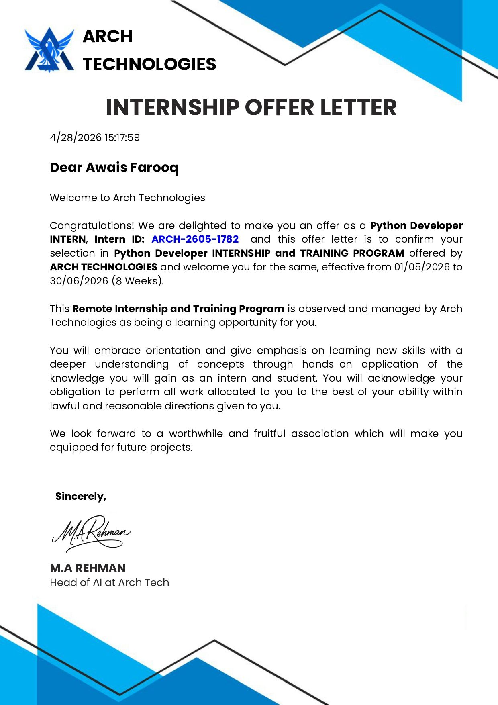
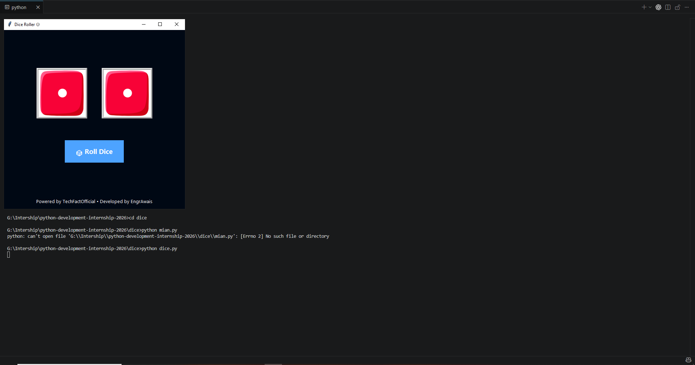
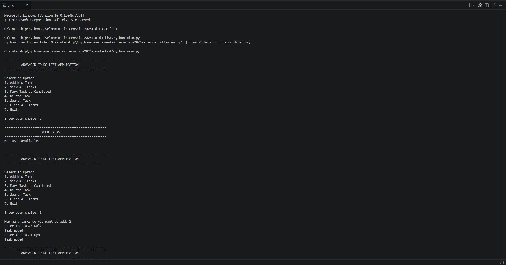
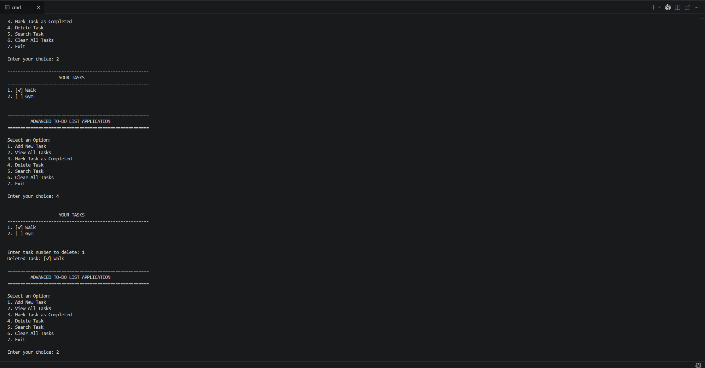
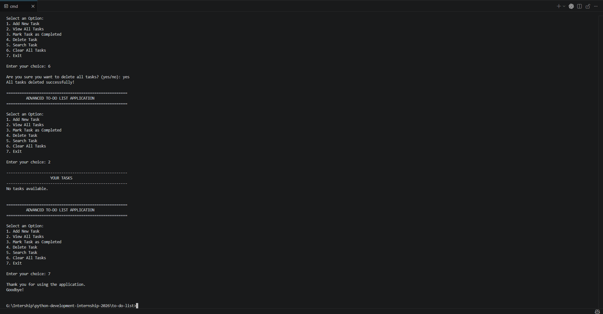
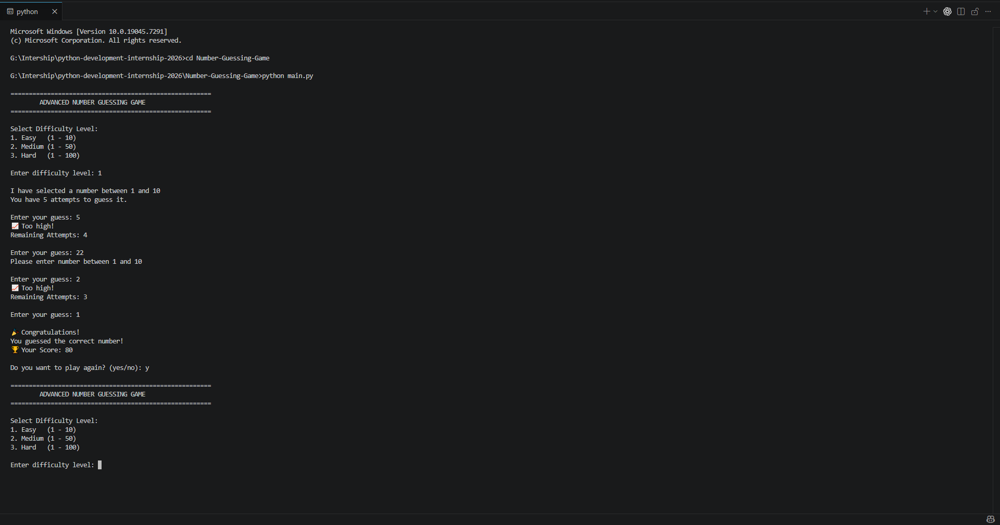
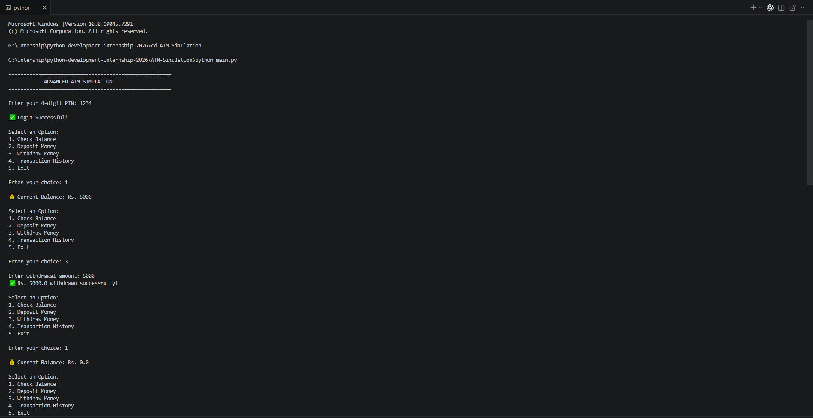
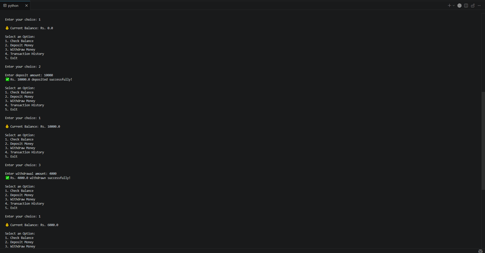
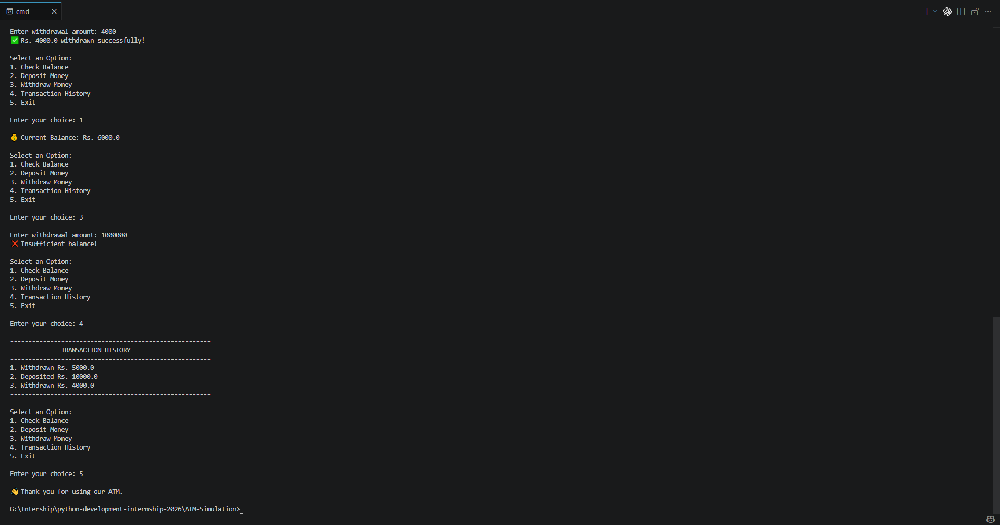
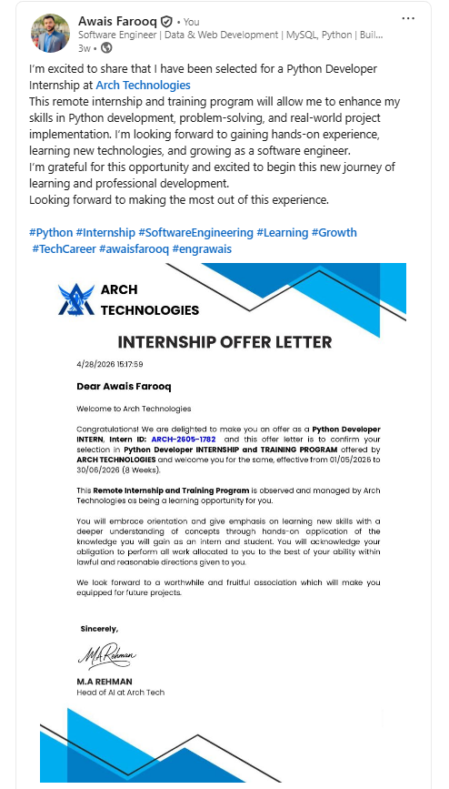

# Python Development Internship Projects 2026


---
 
# 🏆 Python Development Internship Portfolio

> A professional collection of Python Development Internship Projects completed during my internship at **Arch Technologies** in **2026**.

This repository showcases multiple Python applications focused on:

- Backend Logic Development
- Problem Solving
- File Handling
- GUI Development
- Console Applications
- Clean Programming Practices
- Real-World Project Development

---

# 🖼 Internship Project Banner



---

# 🏢 Internship Information

| Details | Information |
|---|---|
| 👨‍💻 Intern Name | Awais Farooq |
| 💼 Internship Domain | Python Development |
| 🏢 Organization | Arch Technologies |
| 📅 Internship Year | 2026 |
| 🆔 Internship ID | ARCH-2605-1782 |
| 🌐 Repository Type | Public Portfolio Repository |

---

# 📌 Internship Verification

These projects were completed during my official **Python Development Internship** at **Arch Technologies**.

The internship focused on:
- Practical Python Development
- Backend Logic Building
- Problem Solving Techniques
- Real-World Programming
- Hands-on Project Development

---

# 📂 Completed Projects

---

# 🎲 Dice Rolling Game

A professional GUI-based dice rolling game developed using Python Tkinter with sound effects, animations, and image handling.

## ✨ Features

- GUI Interface
- Dice Roll Animation
- Random Dice Generation
- Sound Effects
- Interactive Experience

## 🛠 Technologies Used

- Python
- Tkinter
- PIL
- Random Module
- Winsound

## 📸 Screenshots

### 🎯 Final Output



## ▶ Run Project

```bash
python dice.py
```

---

# 📝 To-Do List Application

A feature-rich task management system developed using Python and file handling concepts.

## ✨ Features

- Add Tasks
- Delete Tasks
- Search Tasks
- Complete Tasks
- Persistent Storage
- Input Validation

## 🛠 Technologies Used

- Python
- File Handling

## 📸 Screenshots

### 🚀 Main Menu



### 📋 Task Output



### ✅ Final Result



## ▶ Run Project

```bash
python main.py
```

---

# 🎯 Number Guessing Game

A professional console-based guessing game with score system, replay logic, and input validation.

## ✨ Features

- Difficulty Levels
- Score System
- Replay Option
- Random Number Generation
- Input Validation

## 🛠 Technologies Used

- Python
- Random Module

## 📸 Screenshots

### 🎮 Game Output



## ▶ Run Project

```bash
python main.py
```

---

# 🏧 ATM Simulation

A professional ATM simulation system developed using Python with transaction handling and authentication logic.

## ✨ Features

- PIN Authentication
- Deposit Money
- Withdraw Money
- Balance Checking
- Transaction History
- Error Handling

## 🛠 Technologies Used

- Python

## 📸 Screenshots

### 🏦 ATM Output







## ▶ Run Project

```bash
python main.py
```

---

# 🧠 Skills & Concepts Learned

## 🔹 Python Fundamentals
- Variables
- Data Types
- Operators

## 🔹 Programming Concepts
- Functions
- Loops
- Conditions
- Exception Handling

## 🔹 Backend Logic Development
- Problem Solving
- Input Validation
- User Interaction
- Logic Building

## 🔹 Advanced Concepts
- File Handling
- GUI Development
- Modular Programming
- Random Module Usage

---

# 📄 Project Documentation

Each project contains:
- Professional Source Code
- README Documentation
- Screenshots
- Feature Explanation
- Python Concepts Used

---

# 📁 Repository Structure

```text
python-development-internship-2026/
│
├── ATM-Simulation/
│
├── Number-Guessing-Game/
│
├── dice/
│
├── to-do-list/
│
├── assets/
│   ├── internship-banner.png
│   └── linkedin-post.png
│
└── README.md
```

---

# 🔥 LinkedIn Internship Showcase

[](https://www.linkedin.com/feed/update/urn:li:share:7454891719625551872/)

[](https://www.linkedin.com/feed/update/urn:li:share:7454891719625551872/)

---

# ⚙ How To Run Projects

## 1️⃣ Clone Repository

```bash
git clone https://github.com/captainawais/python-development-internship-2026.git
```

---

## 2️⃣ Open Repository

```bash
cd python-development-internship-2026
```

---

## 3️⃣ Run Any Project

### Dice Game

```bash
python dice.py
```

### Other Projects

```bash
python main.py
```

---

# 📈 Learning Outcome

Through these projects, I improved my:

- Python Programming Skills
- Backend Development Understanding
- Logic Building Techniques
- Problem Solving Ability
- Application Development Experience
- Project Structuring Skills

These projects helped me gain practical hands-on experience in real-world Python development during my internship.

---

# 🤝 Acknowledgment

Special thanks to **Arch Technologies** for providing this valuable internship opportunity and supporting my learning journey in Python Development.

---

# 🌟 Repository Highlights

✅ Professional Internship Portfolio  
✅ Public GitHub Repository  
✅ Real Python Projects  
✅ Backend Logic Development  
✅ GUI + Console Applications  
✅ Practical Programming Experience  

---

# 📬 Connect With Me

## GitHub
https://github.com/captainawais

## LinkedIn
https://www.linkedin.com/in/awais-farooq-388346405

---

# ⭐ Support

If you like this repository, feel free to:

- ⭐ Star the repository
- 🍴 Fork the repository
- 📢 Share the projects

---

# 📌 Conclusion

This repository represents my Python Development Internship journey in 2026 and highlights the projects, concepts, and practical skills I learned during my internship at Arch Technologies.

These projects strengthened my confidence as a Python Developer and improv